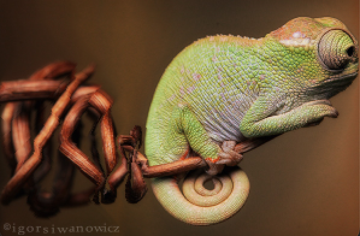

# SeamCarving
 An image-size reduction application (using seam carving techniques) created as part of Princeton's Algorithms Coursera course

### To run
- Run `SeamCarver.java` to see a visualizer of a percolation model
- In the main method:
  - Set the `Picture p` to any `.png` file of your choosing
  - Set the `rowsToRemove` and `colsToRemove`
 
### Reduction Example
#### Original Image (300x600)

#### Reduced by 100 pixels vertically and 300 pixels horizontally (200x300)

#### Video Demo

